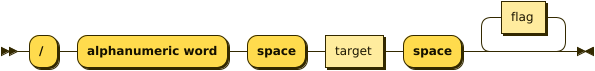
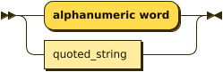
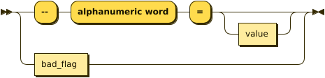

# rpg-chat-command-parser

rpg-chat-command-parser is a Rust library and CLI for parsing and validating RPG-style chat commands. It processes commands in the format commonly used in role-playing games, ensuring correct syntax and extracting useful data for integration into games or simulation systems.

## Parsing Process
### Supported Commands
The parser processes commands like:
- `/cast fireball --power=high`
- `/equip sword`
- `/heal Player1 --boost=strong`

### Grammar Overview
The grammar is defined using Pest and follows these rules:
1. **Command**: Must start with `/`.
2. **Verb**: Specifies the action (e.g., `cast`, `equip`).
3. **Target**: Optional object of the action (e.g., `fireball`, `sword`).
4. **Flags**: Optional key-value modifiers (e.g., `--power=high`).

### Diagram of Grammar Rules
**command:**



```
command  ::= '/' 'alphanumeric word' 'space' target 'space' flag*
```

**target:**



```
target   ::= 'alphanumeric word'
           | quoted_string
```

referenced by:

* command

**flag:**



```
flag     ::= '--' 'alphanumeric word' '=' value?
           | bad_flag
```

referenced by:

* command

**value:**


```
value    ::= 'alphanumeric word'
           | quoted_string
```

referenced by:

* flag

**quoted_string:**


```
quoted_string
         ::= '"' 'text without double-quotes' '"'
```

referenced by:

* target
* value

## 


### Usage
Parsed commands produce a structured output:
```json
{
  "verb": "cast",
  "target": "fireball",
  "flags": {
    "power": "high"
  }
}
```